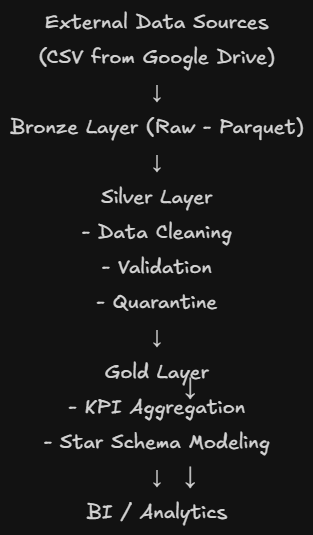

# 📊 End-to-End Data Pipeline (Microsoft Fabric)

## 🚀 Overview

This project implements an end-to-end data pipeline using Microsoft Fabric, transforming raw transactional data into reliable analytical datasets for business insights.

The pipeline is designed following production-oriented principles, including schema enforcement, data validation, and modular architecture.

---

## 🏗️ Architecture

The pipeline follows the Medallion Architecture:

* **Bronze Layer**

  * Ingest raw CSV data from external sources
  * Apply schema enforcement using `StructType`
  * Store data in Parquet format

* **Silver Layer**

  * Perform data cleaning and transformation
  * Apply validation rules via reusable validation module
  * Handle invalid data using quarantine tables
  * Implement business logic (e.g., refund handling)

* **Gold Layer**

  * Compute business KPIs
  * Build Star Schema for analytical queries
---
## 🔁 Pipeline Orchestration

The pipeline is designed as modular stages:

- Bronze Pipeline: Data ingestion from external sources
- Silver Pipeline: Data cleaning and validation
- Gold Pipeline: Business aggregation and modeling
- Master Pipeline: Orchestrates execution using pipeline dependencies

This modular design improves maintainability and allows independent execution of each layer.

---

## 🔄 Data Flow

CSV → Bronze (raw) → Silver (clean + validation + quarantine) → Gold (analytics + star schema)

---

## 🧠 Data Engineering Practices

This project incorporates key data engineering practices:

* **Schema Enforcement**: Avoids schema drift by explicitly defining data types
* **Data Validation**: Centralized validation logic via `utils/validation.py`
* **Quarantine Handling**: Invalid records are preserved for auditing
* **Business Logic Handling**:

  * Failed orders are excluded
  * Refunded orders are converted to negative revenue
* **Fault Tolerance**:

  * Uses `overwrite` mode to ensure idempotency
* **Fallback Handling**:

  * Missing exchange rates default to 1 to prevent data loss

---

## 🧩 Data Modeling (Star Schema)

The Gold layer follows a Star Schema design to support efficient analytical queries.

* **Fact Table (`fact_sales`)**
  Stores transactional-level data, including revenue metrics (`revenue_vnd`) and foreign keys linking to dimension tables. This table represents the lowest level of granularity (per order).

* **Dimension Tables**

  * `dim_date`: Provides time-based attributes (year, month) for temporal analysis
  * `dim_product`: Contains product-related information (item_id, item_name)
  * `dim_location`: Contains location-related attributes (location_id, location_name)

The schema is designed to separate measurable data (facts) from descriptive attributes (dimensions), enabling flexible and scalable business analysis.

Exchange rate data is applied during transformation (Silver/Gold layer) rather than modeled as a dimension, as it serves a computational purpose rather than analytical slicing.

---

## 📐 Schema Design

Example (Silver layer):

* order_id: string
* order_date: timestamp
* total_amount: double
* order_status: string
* feedback_score: integer

---

## ⚙️ Data Quality Handling

* Null filtering and type casting
* Business rule validation
* Invalid data isolation (quarantine tables)
* Data consistency checks across layers

---

## 🛠️ Tech Stack

* Microsoft Fabric
* PySpark
* Data Factory Pipeline
* Delta Lake / Parquet
* Draw.io / Mermaid

---

## ⚠️ Limitations & Future Improvements

* No schema evolution handling (assumes stable schema)
* No incremental loading (batch overwrite strategy)
* Limited Spark optimization (configured for small-scale data)

Future improvements:

* Implement incremental processing (MERGE / upsert)
* Add monitoring and alerting system
* Handle schema evolution dynamically
* Optimize Spark configurations for large-scale workloads

---
## 📂 Project Structure
project/
│
├── notebooks/
│   ├── bronze/
│   ├── silver/
│   ├── gold/
│
├── configs/
│   └── schema.py
│
├── utils/
│   └── validation.py
│
├── pipelines/
├── architecture/
├── erd/
└── README.md

---

## 👤 Author

* Lany - Lam Kim Ngan
